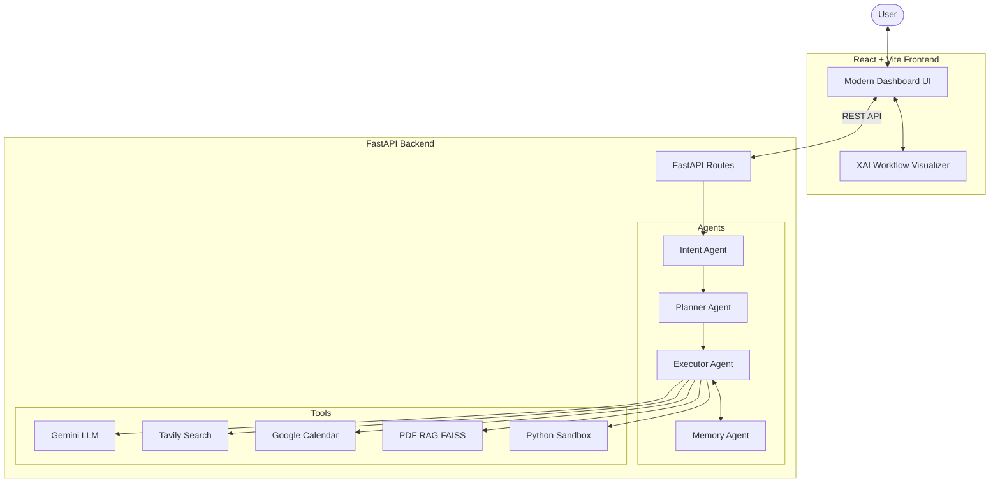

# 🚀 AURORA-AI Platform
### Autonomous Unified Reasoning & Orchestration AI

---

## 🧠 Overview

AURORA-AI is a production-ready, multi-agent AI platform designed to perform reasoning, planning, and task execution using Large Language Models (LLMs).

This project has been transformed from a CLI workshop demo into a polished, modern Agentic AI application with a FastAPI backend and a React/Vite frontend. It integrates Google Calendar scheduling, web research, Python code execution, Retrieval-Augmented Generation (RAG), and memory systems.

---

## ✨ Features

- **Modern SaaS UI**: A professional dark-mode UI built with React, Vite, Tailwind CSS, and Framer Motion.
- **Explainable AI (XAI)**: A real-time **Workflow Timeline** visualizes the Agent's reasoning, intent detection, tool selection, and step-by-step execution.
- **Multi-Agent Architecture**:
  - **Intent Agent**: Classifies queries.
  - **Planner Agent**: Decomposes complex tasks.
  - **Executor Agent**: Invokes tools and aggregates results.
  - **Memory Agent**: Long-term context persistence.
- **Dedicated Interfaces**:
  - **Chat**: General conversational AI with markdown and XAI workflow.
  - **Research Agent**: Autonomous deep web research using Tavily.
  - **Document Intelligence (RAG)**: Drag-and-drop PDF ingestion with semantic search QA.
  - **Calendar Agent**: Seamless Google Calendar scheduling.
  - **Analytics Dashboard**: Real-time system monitoring.

---

## 🏗️ Architecture



---

## 🛠️ Technology Stack

| Component | Technology |
|---|---|
| **Frontend Framework** | React 18, Vite, TypeScript |
| **Frontend Styling** | Tailwind CSS, Framer Motion |
| **Backend Framework** | FastAPI, Pydantic, Uvicorn |
| **AI Models** | Google Gemini (2.5 Flash) |
| **Agent Paradigm** | Custom ReAct Loop, Native Tool Calling |
| **Vector DB** | ChromaDB, FAISS |
| **Data Fetching** | Axios, Recharts |

---

## 🚀 Installation & Setup

### 1. Clone the Repository

```bash
git clone https://github.com/Revanth-3995/aurora-ai.git
cd aurora-ai
```

### 2. Backend Setup

```bash
# Create and activate virtual environment
python -m venv .venv
source .venv/bin/activate  # On Windows: .venv\Scripts\activate

# Install backend dependencies
pip install -r requirements.txt

# Create .env file in the root directory
echo "GEMINI_API_KEY=your_key_here" >> .env
echo "TAVILY_API_KEY=your_key_here" >> .env
echo "ENABLE_GOOGLE_CALENDAR=true" >> .env
echo "ENABLE_ADVANCED_CODE_TOOL=true" >> .env
echo "ENABLE_ADVANCED_RESEARCH_TOOL=true" >> .env

# Run the FastAPI server
uvicorn backend.main:app --reload --port 8000
```

### 3. Frontend Setup

```bash
# Open a new terminal
cd frontend

# Install frontend dependencies
npm install

# Start the development server
npm run dev
```

---

## 📡 API Documentation

The backend provides several RESTful endpoints documented automatically by FastAPI (Swagger UI available at `http://localhost:8000/docs`).

- `POST /chat`: Submit a query. Returns `{ response, intent, tool_used, reasoning, workflow }`.
- `POST /research`: Trigger the autonomous research agent.
- `POST /documents/upload`: Upload and ingest a PDF to the RAG FAISS database.
- `POST /documents/ask`: Ask questions against the ingested knowledge base.
- `POST /calendar`: Schedule Google Calendar events.
- `GET /analytics`: Retrieve mock system statistics for the dashboard.
- `GET /health`: System health check.

---

## 🔮 Future Scope

- **User Authentication**: Multi-user support with isolated RAG databases and OAuth.
- **Voice Capabilities**: Whisper integration for voice-to-text.
- **Agent Memory Optimization**: Implement memory decay algorithms to manage long-term token limits.
- **Dockerization**: Complete containerization for 1-click deployment.

---

## 🤝 Contributors

Created for AI workshops, academic portfolios, and GitHub showcases to demonstrate real-world Agentic AI architecture.
